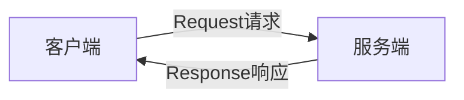

@[toc](目录)
# HTTP协议解析
HTTP即超文本传输协议，是一种详细规定了浏览器和万维网服务器之间相互通讯规则的协议。它是万维网交互信息的基础。它允许HTML从Web服务器传送到Web浏览器。
# 发起HTTP请求
1. 在浏览器中输入URL（统一资源定位符）按回车就会发起HTTP请求。
URL格式如下：`协议://服务器IP[:端口]/路径/[?查询]`
2. 借助Linux中的curl命令curl http://www.baidu.com可以返回HTML的数据（加上-I命令可以显示返回的HTTP响应头）
3. Windows可以借助curl.exe文件

#  HTTP协议详解
HTTP协议遵循请求(Request)/应答(Response)模型

## HTTP请求
HTTP请求包括三个部分，分别是请求行（请求方法），请求头（消息报头），和请求正文。
例如
```python
GET / HTTP/1.1								//请求行
Host: www.xxser.com							//请求头
Upgrade-Insecure-Requests: 1
User-Agent: Mozilla/5.0 (Windows NT 10.0; Win64; x64) AppleWebKit/537.36 (KHTML, like Gecko) Chrome/90.0.4430.72 Safari/537.36
Accept: text/html,application/xhtml+xml,application/xml;q=0.9,image/avif,image/webp,image/apng,*/*;q=0.8,application/signed-exchange;v=b3;q=0.9
Accept-Encoding: gzip, deflate
Accept-Language: zh-CN,zh;q=0.9
Connection: close
											//空白行，表示请求头结束
Username=admin&password=admin  				//请求正文

```
## HTTP响应
HTTP响应也包括三个部分，分别是响应行，响应头和响应正文
例如
```py
HTTP/1.1 200 OK								//响应行
Connection:close							//响应头
Content-Type:text/html
Content-Length:223
Cache-Control:no-store
											//空白行，表示请求头结束
<html>										//响应正文
<head>
<script language="javascript">setTimeout("location.replace(location.href.split(\"#\")[0])",1000);</script>
</head>
<iframe src="http://172.16.61.102:89/flashredir.html" frameborder=0></iframe>
</html>


```
# HTTP请求方法
HTTP的请求方法有很多，其中POST和GET请求最常见。
## GET
GET方法用于获取请求页面的指定信息（以实体的格式）。如果请求资源为动态脚本（非HTML），那么返回文本时Web容器解析后的HTML源代码，而不是源文件。例如请求index.jsp，返回的不是index.jsp的源文件，而是经过解析后的HTML代码。
如下HTTP请求：
GET /index.php?id=1 HTTP/1.1
HOST: www.xser.com
使用GET请求index.php，并且id的参数为1，在服务器端脚本语言中可以选择性地接受这些参数，比如id=1&name=admin,一般都是由开发者内定好的参数项目才会接收，比如开发者只接收id参数项目，若加了其他参数项，如：
index.php?id=1&username=admin   				//多个参数以"&"连接
但是服务端脚本不会理会你加入的内容，依然只会接收id参数，并且去查询数据，最终向服务器端发送解析过的HTML数据，不会因为你的干扰而出现问题。
## HEAD
HEAD方法除了服务器不能在响应里返回消息主体外，其他都和GET方法相同。此方法经常用来测试超文本链接的有效性，可访问性和最近的改变。扫描脚本经常用此方法。速度最快。
```py
HEAD / HTTP/1.1
HOST:www.baidu.com

```
## POST
POST方法也和GET方法类似，最大区别在于，GET方法没有请求内容，POST方法有请求内容。POST最多用于向服务器发送大量的数据。GET虽然能发送数据，但是数据的长度受限。并且GET发送的数据会在浏览器上显示，但是POST请求不会，所以安全性稍微高一点。
```py
POST /check_login.php HTTP/1.1
Host: mng.shequnabc.com

username=admin&userpwd=qwe
```
这是一个POST数据包的信息。
向mng.shequnabc.com这个网站发送了username=admin和userpwd=qwe数据
## PUT
PUT方法用于请求服务器中的实体存储在请求资源下，如果请求资源已经在服务器中存在，那么将会用此请求中的数据替代原先的数据，作为制定资源的最新修改版。如果请求指定的资源不存在，将会创建这个资源，且数据位于请求正文。请求如下：
PUT /input.txt
HOST: www.xxser.com
Content-Length: 6
123456
这段HTTP PUT请求会在主机根目录下创建input.txt文件，内容为123456.通常情况下服务器会关闭PUT方法。
## DELETE
DELETE方法用于请求资源服务器删除请求的指定资源。通常情况下服务器会关闭DELETE方法。它会删除文件。
## TRACE
TRACE方法被用于激发一个远程的应用层的请求消息回路，也就是说，回显服务器收到的请求。TRACE方法允许客户端去了解数据被请求链的另一端接受的情况，并利用那些数据信息去测试或诊断。但此方法很少见。
## CONNECT
HTTP1.1协议保留了CONNECT方法，此方法是为了用于能动态切换到隧道的代理。
## OPTIONS
OPTIONS方法是用于请求获得URI标识的资源在请求/响应的通信过程中可以使用的功能选项。通过这个方法，客户端可以再采取具体资源请求之前，决定对资源采用何种必要的措施，或了解服务器的性能。

# HTTP状态码
当客户端发出HTTP请求，服务端接收后，回想客户端发送响应信息，其中，HTTP响应中的第一行中，最重要的一点就是HTTP状态码。
1. 1xx 信息提示，表示请求已被成功接收，继续处理。范围为100-101
2. 2xx 成功。服务器成功地处理了请求，范围为200-206
3. 3xx 重定向，重定向状态码用于告诉浏览器，他们访问的资源已经被移动，并告诉浏览器移动的位置。浏览器会重新发送请求。范围为300-305
4. 4xx 客户端错误状态码，有时候客户端会发送一些服务器无法处理的东西，比如格式错误的请求，或者不存在的URL。范围为400-415
5. 5xx 服务器错误状态码，有时候客户端发送了一条有效的请求。但Web服务器本身出错，可能是Web服务器运行出错了，或者网站挂了。范围为500-505

常见的状态码：
1. 200：客户端请求成功
2. 302：重定向
3. 404：请求资源不存在
4. 400：客户端请求有语法错误，不能被服务器理解
5. 401：请求未经授权
6. 403：服务器收到请求，但是拒绝提供服务
7. 500：服务器内部错误
8. 503服务器当前不能处理客户端请求，一段时间后可能恢复正常
 
# HTTP消息
HTTP消息又被称为HTTP头，由4部分组成。分别是请求头，响应头，普通头，实体头。
 
## 请求头
请求头只出现在HTTP请求中请求报头允许客户端向服务器传递请求的附加信息和客户端自身的信息。常见的请求头如下：
1. Host 请求报头域只要勇于指定被请求资源的Internet主机和端口号
2. User-Agent 请求报头域允许客户端将它的操作系统，浏览器和其他属性告诉服务器。登录一些网站时，很多时候都可以见到显示我们的浏览器，系统信息，这些都是此头的作用。
3. Referer 表示访问当前网站的上一个URL。（从哪个网站跳转过来的）
4. Cookie 表示请求者身份
5. Range 多线程下载会用到
6. x-forward-for 表示请求端的IP可以有多个，中间用逗号隔开
7. Accept 指定客户端接收到那些MIME类型的信息如：Accept: text/html 表明客户端希望收到html文本
8. Accept-charset 用于指定客户端接收的字符集
## 响应头
1. Sever 服务器所使用的Web服务器名称
2. Set-Cookie 向客户端设置Cookie
3. Last-Modified 服务器通过这个头告诉浏览器，资源的最后修改时间
4. Location 服务器通过这个头告诉浏览器去访问哪个页面。通常与302跳转一起使用
5. Refresh 服务器告诉浏览器定时刷新
## 普通头
在普通头中，有少数报头域用于所有的请求和响应消息，但并不用于呗传输的实体，只用于传输的消息，例如Date，表示消息产生的日期和时间。Connection，允许发送指定连接的选项。
## 实体头
1. Content-Type 实体头用于向接收方指示实体的介质类型
2. Content-Encoding 用作媒体类型的修饰符，指示已经被应用到实体正文的附件内容编码，因而要获得Content-Type报头域中所引用的媒体类型，必须采用相应的解码机制。
3. Content-Length 用于指明实体正文长度。
4. Last-Modified 实体报头用于指示资源的最后修改日期
# 模拟HTTP请求
## 使用Telnet模拟HTTP请求访问www.baidu.com
1. 打开cmd，输入Telnet www.baidu.com 80回车，然后利用Ctrl+]来打开Telnet回显。
2. 按回车进入编辑状态
3. 输入以下代码
```py
GET /index.html HTTP/1.1
HOST: www.baidu.com

```
# HTTP协议和HTTPS协议的区别
HTTPS协议是以安全为目的的HTTP通道，就是HTTP的升级版本。
HTTPS安全的基础是SSL即在HTTP的基础上加入了SSL层。也就是HTTPS通过安全传输机制来进行传输数据。
HTTP和HTTPS的区别：
1. HTTP是超文本传输协议，信息是明文传输。HTTPS是具有安全性的SSL加密传输的协议
2. HTTP(80)与HTTPS(443)协议端口不同
3. HTTPS协议需要到ca申请证书，一般免费的证书少，需要交费。但HTTP不需要
4. HTTP连接简单，无状态。HTTPS协议是由SSL+HTTP协议构建的可进行加密传输，身份认证的网络协议，相对来说，它要比HTTP协议更安全。
