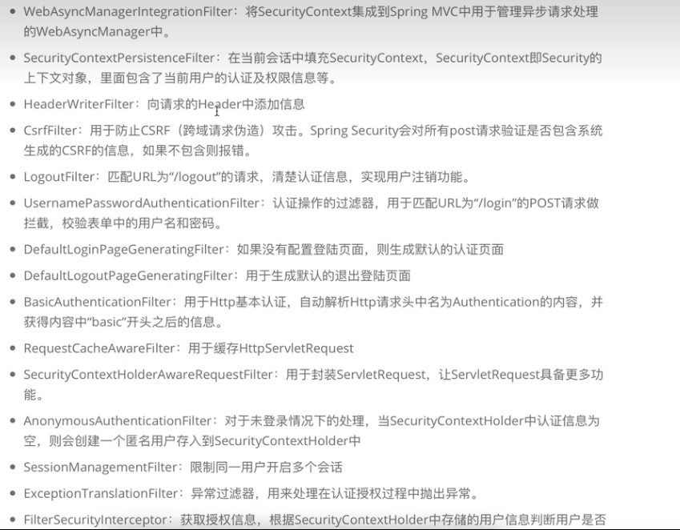
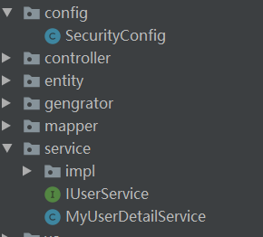

# SpringSecurity

## 简介

> 一个安全框架，用于用户认证和用户鉴权

## 简单使用

1. 创建maven工程
2. 添加springsecurity依赖

## 过滤器链



在SpringBoot项目中，SpringBoot会自动配置DelegatingFilterProxy，而这个过滤器会加载SpringSecurity的15个过滤器

## 认证

> 判断用户是否在系统中，并且判断用户身份是否合法。

### 认证方式

1. HTTP基本认证
2. Form表单认证
3. HTTP摘要认证

```java
// 1. 基本认证
@EnableWebSecurity
public class SecurityConfig  extends WebSecurityConfigurerAdapter {
    @Override
    protected void configure(HttpSecurity http) throws Exception {
        http.authorizeRequests()
                .anyRequest()
                .authenticated()
                .and()
                .httpBasic();
    }
}

/**
* 用户首先发起一个未认证的请求
* 服务端返回401的响应信息，并在www-authentication头显示需要进行基本认证
* 浏览器弹出对话框显示需要输入用户名和密码。输入后已BASE64形式发送给服务端
* 服务器进行效验并返回数据
*/

// 用户每次访问都需要带着base64(user:pass)的信息=>无法携带session信息
```


```java
// Form表单认证

package com.sec.demo.config;

import org.springframework.security.config.annotation.authentication.builders.AuthenticationManagerBuilder;
import org.springframework.security.config.annotation.web.builders.HttpSecurity;
import org.springframework.security.config.annotation.web.builders.WebSecurity;
import org.springframework.security.config.annotation.web.configuration.EnableWebSecurity;
import org.springframework.security.config.annotation.web.configuration.WebSecurityConfigurerAdapter;

@EnableWebSecurity
public class SecurityConfig  extends WebSecurityConfigurerAdapter {
    @Override
    protected void configure(HttpSecurity http) throws Exception {
        http.authorizeRequests()
                .anyRequest()
                .authenticated()
                .and()
                .formLogin()
                .loginPage("/login.html")
                .permitAll()
                //当登录成功后指定跳转
                .defaultSuccessUrl("/index.html",true)
                // post登录
                .loginProcessingUrl("login")
                // 登录失败
                .failureUrl("/error.html")
                .usernameParameter("username")
                .passwordParameter("password")
                .and()
                // 注销接口
                .logout()
                .logoutUrl("/logout")
                .logoutSuccessUrl("/login.html")
                .permitAll()
                .deleteCookies("myCookie")
                .and()
                .csrf()
                .disable();
    }

    /**
     * 请求哪些资源时不需要做认证
     * @param web
     * @throws Exception
     */
    @Override
    public void configure(WebSecurity web) throws Exception {
        web.ignoring()
                .antMatchers("/js/**","/css/**","/images/**");
    }
```

`这里我一直302不知道什么原因`

```java
// 摘要认证
```


## 自定义用户名和密码

1. 使用application

   ```yml
   spring:
   	security:
   		user:
   			name: admin
   			password: admin
   		
   ```

   ```java
       @Bean
       public PasswordEncoder passwordEncoder(){
           return new BCryptPasswordEncoder();
       }
   ```

2. 配置类

   ```java
   // Form表单认证
   
   package com.sec.demo.config;
   import org.springframework.beans.factory.annotation.Autowired;
   import org.springframework.context.annotation.Bean;
   import org.springframework.security.config.annotation.authentication.builders.AuthenticationManagerBuilder;
   import org.springframework.security.config.annotation.web.configuration.EnableWebSecurity;
   import org.springframework.security.config.annotation.web.configuration.WebSecurityConfigurerAdapter;
   import org.springframework.security.crypto.bcrypt.BCryptPasswordEncoder;
   import org.springframework.security.crypto.password.PasswordEncoder;
   @EnableWebSecurity
   public class SecurityConfig  extends WebSecurityConfigurerAdapter {
       
       @Bean
       public PasswordEncoder passwordEncoder(){
           return new BCryptPasswordEncoder();
       }
   
       @Override
       protected void configure(AuthenticationManagerBuilder auth) throws Exception {
           BCryptPasswordEncoder passwordEncoder = new BCryptPasswordEncoder();
           // 生成密码密文
           String password = passwordEncoder.encode("123456");
           // 设置用户名和密码
           auth.inMemoryAuthentication().withUser("admin")
                   .password(password)
                   .roles("admin");
       }
   }
   
   ```

   

## 去数据库查询信息然后验证用户登录情况

1. 自己写一个查询用户的Mapper
2. 写一个类实现UserDetailsService，重写loadUserByUsername方法，创建一个org.springframework.security.core.userdetails.User对象，然后将查到的用户的密码传入，最后再传入一个权限效验的对象

```java

package com.sec.demo.service;
import com.mysql.cj.util.StringUtils;
import com.sec.demo.entity.User;
import com.sec.demo.mapper.UserMapper;
import org.springframework.beans.factory.annotation.Autowired;
import org.springframework.security.core.GrantedAuthority;
import org.springframework.security.core.authority.AuthorityUtils;
import org.springframework.security.core.userdetails.UserDetails;
import org.springframework.security.core.userdetails.UserDetailsService;
import org.springframework.security.core.userdetails.UsernameNotFoundException;
import org.springframework.stereotype.Service;
import java.util.List;
import java.util.Objects;
@Service
public class MyUserDetailService implements UserDetailsService {
    @Autowired
    private UserMapper userMapper;
    /**
     *
     * @param username
     * @return
     * @throws UsernameNotFoundException
     */
    @Override
    public UserDetails loadUserByUsername(String username) throws UsernameNotFoundException {
        // 根据用户输入的用户名去数据库查询用户对象
        if(StringUtils.isNullOrEmpty(username)){
            return null;
        }
        // 数据库查询
        User user = userMapper.selectByUsername(username);
        org.springframework.security.core.userdetails.User u = null;
        if(Objects.nonNull(user)){
            // 权限相关
            List<GrantedAuthority> grantedAuthorities = AuthorityUtils.commaSeparatedStringToAuthorityList("user");
            u = new org.springframework.security.core.userdetails.User(user.getUsername(),user.getPassword(),grantedAuthorities);
        }
        return u;
    }
}
```

3. 写配置类

```java
// Form表单认证

package com.sec.demo.config;


import org.springframework.beans.factory.annotation.Autowired;
import org.springframework.context.annotation.Bean;
import org.springframework.security.config.annotation.authentication.builders.AuthenticationManagerBuilder;
import org.springframework.security.config.annotation.web.configuration.EnableWebSecurity;
import org.springframework.security.config.annotation.web.configuration.WebSecurityConfigurerAdapter;
import org.springframework.security.core.userdetails.UserDetailsService;
import org.springframework.security.crypto.bcrypt.BCryptPasswordEncoder;
import org.springframework.security.crypto.password.PasswordEncoder;


@EnableWebSecurity
public class SecurityConfig  extends WebSecurityConfigurerAdapter {

    @Autowired
    private UserDetailsService UserDetailService;


    @Bean
    public PasswordEncoder passwordEncoder(){
        return new BCryptPasswordEncoder();
    }

    @Override
    protected void configure(AuthenticationManagerBuilder auth) throws Exception {

        auth.userDetailsService(UserDetailService).passwordEncoder(passwordEncoder());
    }
}

```

最终目录结构如下



## 角色和权限

